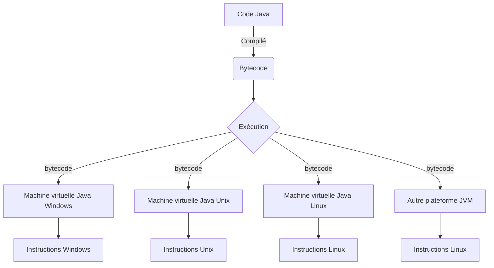
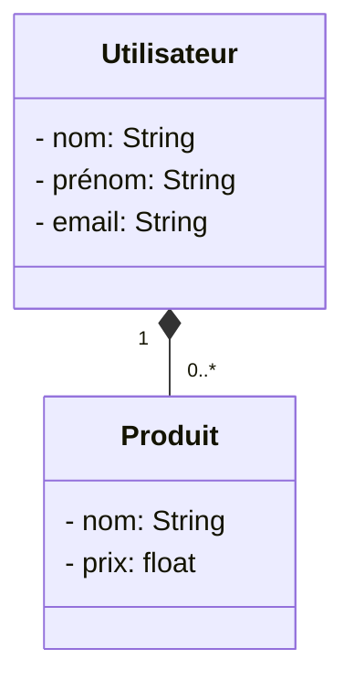
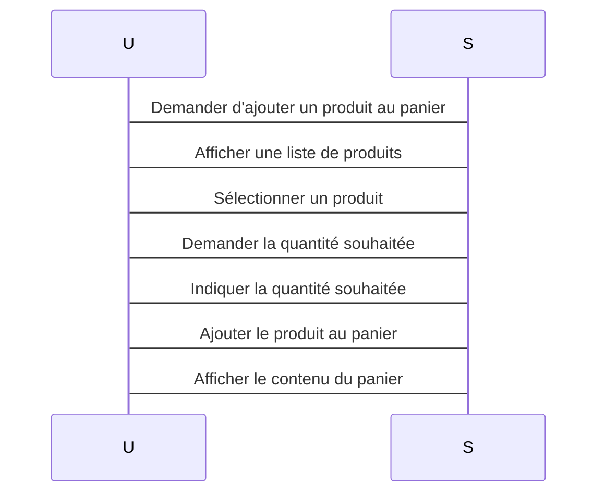

# Formation JAVA  WEB

## Date et Lieu

- **Date:** Du Mercredi 11 au Vendredi 13 Octobre 2023
- **Lieu:** ORANGE

## Plan de Formation

| Jour  | Contenu                                                                                    |
|-------|--------------------------------------------------------------------------------------------|
| Jour 1| - Introduction à Java<br> - Définition du langage Java<br> - Installation de l'environnement de développement Java<br> - Écriture d'un premier programme Java<br> - Opérateurs en Java<br>   - Opérateurs arithmétiques<br>   - Opérateurs logiques<br>   - Opérateurs de comparaison<br>   - Opérateurs de flux<br>   - Opérateurs de chaîne de caractères<br> - Les bases de la programmation orientée objet<br>   - Classes et objets<br>   - Héritage<br>   - Encapsulation<br>   - Interfaces<br>   - Exceptions<br> |
| Jour 2| - Collections en Java<br>   - Listes : ArrayList, LinkedList, Vector<br>   - Ensembles (Set) : HashSet, LinkedHashSet, TreeSet<br>   - Maps : HashMap, LinkedHashMap, TreeMap<br> - Entrée/sortie (E/S) en Java<br>   - Lecture et écriture de fichiers texte<br>   - Lecture et écriture de fichiers binaires<br> - Tests unitaires en Java<br>   - Définition des tests unitaires<br>   - Écrire des tests unitaires<br>   - Exécuter des tests unitaires<br> |
| Jour 3| - Développement d'une application Web simple<br>   - Création de contrôleurs<br>   - Utilisation de Thymeleaf pour les vues<br> - Gestion des données avec Spring Boot<br>   - Utilisation de Spring Data JPA<br>   - Intégration d'une base de données (par exemple, MySQL, H2)<br> - Exercices de consolidation<br>   - Jour 1 : Écrire un programme Java qui calcule le volume d'un cylindre<br>   - Jour 2 : Écrire un test unitaire pour un programme Java qui calcule le volume d'un cylindre<br>   - Jour 3 : Créer une application web Spring Boot simple qui affiche une liste de produits<br> |


## Objectifs de la formation

À l'issue de cette formation, les participants seront capables de :
- Comprendre les bases du langage Java
- Utiliser les concepts de la programmation orientée objet
- Écrire des tests unitaires en Java
- Créer des applications web Spring Boot

## Prérequis

Aucun prérequis n'est nécessaire pour suivre cette formation. Cependant, une connaissance de base de l'informatique est recommandée.

## Méthodes pédagogiques

La formation combinera des exposés théoriques et des exercices pratiques. Les participants auront l'occasion de mettre en pratique les concepts appris lors de la formation.

## Matériel nécessaire

- Un ordinateur portable avec Java installé
- Un IDE Java (comme Eclipse ou IntelliJ IDEA)
- Un compte GitHub

## Modalités d'évaluation

Les participants seront évalués sur la base de leurs participations aux exercices et à la réalisation du TP.

## Formateur

**SANOGO  Souleymane**
- Architecte Logiciel avec 18 ans d'expérience*
- Mentor Formateur JAVA JEE OpenClassRooms
- **Formateur Architecture Logiciel, JAVA, JEE, Android, Python, Web**
- **Formateur Gestion de Projet Agile et Coach Agile**

- **Site Web de APM :** [Site de APM](https://africa-project-management1.odoo.com/)
- **Contact :** 00 225 02 41 51 67
- **LinkedIn :** [www.linkedin.com/in/souleymanesanogo](http://www.linkedin.com/in/souleymanesanogo/)


```
# Plan de formation Java Web sur 3 jours

## Jour 1

### Introduction à Java

* Définition du langage Java
* Installation de l'environnement de développement Java
* Écriture d'un premier programme Java

### Opérateurs en Java

* Opérateurs arithmétiques
* Opérateurs logiques
* Opérateurs de comparaison
* Opérateurs de flux
* Opérateurs de chaîne de caractères
  
### Les bases de la programmation orientée objet

* Classes et objets
* Héritage
* Encapsulation
* Interfaces
* Exceptions


## Jour 2

### Collections en Java

* Listes : ArrayList, LinkedList, Vector.
* Ensembles (Set) : HashSet, LinkedHashSet, TreeSet.
* Maps : HashMap, LinkedHashMap, TreeMap.


### Entrée/sortie (E/S) en Java

* Lecture et écriture de fichiers texte
* Lecture et écriture de fichiers binaires

### Tests unitaires en Java

* Définition des tests unitaires
* Écrire des tests unitaires
* Exécuter des tests unitaires

## Jour 3

### Développement d'une application Web simple

* Création de contrôleurs
* Utilisation de Thymeleaf pour les vues

### Gestion des données avec Spring Boot

* Utilisation de Spring Data JPA
* Intégration d'une base de données (par exemple, MySQL, H2)

## Exercices de consolidation

* Jour 1 : Écrire un programme Java qui calcule le volume d'un cylindre.
* Jour 2 : Écrire un test unitaire pour un programme Java qui calcule le volume d'un cylindre.
* Jour 3 : Créer une application web Spring Boot simple qui affiche une liste de produits.

## Objectifs de la formation

À l'issue de cette formation, les participants seront capables de :

* Comprendre les bases du langage Java
* Utiliser les concepts de la programmation orientée objet
* Écrire des tests unitaires en Java
* Créer des applications web Spring Boot

## Prérequis

Aucun prérequis n'est nécessaire pour suivre cette formation. Cependant, une connaissance de base de l'informatique est recommandée.

## Méthodes pédagogiques

La formation combinera des exposés théoriques et des exercices pratiques. Les participants auront l'occasion de mettre en pratique les concepts appris lors de la formation.

## Matériel nécessaire

* Un ordinateur portable avec Java 11 installé
* Un IDE Java (comme Eclipse ou IntelliJ IDEA)
* Un compte GitHub

## Modalités d'évaluation

Les participants seront évalués sur la base de leurs participations aux exercices et à la réalisation du TP.


# Formation  Initiation  à  JAVA WEB par la Pratique

## Chapitre 1: Introduction à Java

**Définitions**


Java : Java est un langage de programmation de haut niveau, robuste, orienté objet et sécurisé. Il a été développé par Sun Microsystems (maintenant acquis par Oracle).

**Java** est un langage de programmation de haut niveau, orienté objet et largement utilisé dans le développement logiciel.

 Il a été créé par **James Gosling**, **Mike Sheridan**, et **Patrick Naughton** chez **Sun Microsystems** en 1991. Java est conçu pour être portable, performant et sûr, ce qui signifie qu'il peut fonctionner sur divers systèmes d'exploitation sans nécessiter de modifications majeures.

### Historique et Versions de Java :

- **1995 :** Java 1.0 (JDK 1.0) - Première version publique de Java.
- **1997 :** Java 1.1 - Ajout de l'API JDBC pour la connectivité avec les bases de données.
- **1998 :** Java 1.2 (J2SE 1.2) - Introduction des Collections, Swing GUI, et Java Naming and Directory Interface (JNDI).
- **2000 :** Java 1.3 - Améliorations de l'API de gestion des événements et des performances.
- **2002 :** Java 1.4 - Intégration de la machine virtuelle Java HotSpot, ajout de la gestion de la mémoire améliorée et de l'API Java Logging.
- **2004 :** Java 5 (Java 1.5) - Introduction de generics, annotations, enum, et Java Concurrent Package.
- **2006 :** Java 6 (Java 1.6) - Améliorations des performances, introduction de Java Compiler API et Java Web Start.
- **2011 :** Java 7 (Java 1.7) - Ajout de l'API ForkJoinPool, gestion automatique des ressources (try-with-resources) et les expressions switch.
- **2014 :** Java 8 (Java 1.8) - Introduction des Lambdas, Streams, l'API java.time pour la gestion du temps, et l'interface Optional.
- **2017 :** Java 9 - Modules Java, JShell (REPL), Java Platform Module System (JPMS).
- **2018 :** Java 10 - Inferencing de type local, améliorations de l'API Optional, et l'API `var` pour les variables locales.
- **2018 :** Java 11 - Local-Variable Syntax for Lambda Parameters, HTTP Client standard (remplacement de `HttpURLConnection`).
- **2019 :** Java 12 - Switch Expressions, API Teardown, et Java Microbenchmarking Harness (JMH).
- **2019 :** Java 13 - Text Blocks, Dynamic CDS Archives, ZGC (garbage collector) amélioré.
- **2020 :** Java 14 - Pattern Matching for switch (JEP 361), Records (JEP 359), `instanceof` Patterns.
- **2021 :** Java 15 - Pattern Matching for `instanceof` (JEP 394), Records and Sealed Types Updates, Foreign Function & Memory API (JEP 393).
- **2021 :** Java 16 - Records (Améliorations), Pattern Matching for switch (Améliorations), Vector API (incubateur), Project Panama (incubateur).
- **2022 :** Java 17 - Strong encapsulation, Pattern Matching for switch (Améliorations), Sealed classes (Améliorations).

## Caractéristiques Principales

```
Orienté Objet : Java est un langage orienté objet, ce qui signifie qu'il se base sur la notion d'objets.
Plateforme Indépendante : Les programmes Java peuvent être exécutés sur n'importe quelle plateforme qui prend en charge Java.
Sécurisé : Java est conçu pour être sécurisé, avec un système de gestion de la mémoire et des mécanismes de sécurité intégrés.
Multithreadé : Java prend en charge la programmation multithreadée, permettant l'exécution simultanée de plusieurs threads.
```

**Syntaxe**

```java

public class HelloWorld {
    public static void main(String[] args) {
        System.out.println("Hello, world!");
    }
}
```

Exemples de Code
Création d'une classe Java simple pour afficher "Hello, world!".
### Comparaison avec C++ et Autres Langages POO :

Java et C++ sont deux langages de programmation orientés objet, mais ils diffèrent dans plusieurs aspects. Java est plus portable, sécurisé avec son modèle de gestion de la mémoire (pas de pointeurs), et dispose d'une syntaxe plus simple. C++ offre plus de contrôle sur la mémoire, ce qui peut entraîner des erreurs si mal géré, mais offre également des performances potentiellement supérieures.

Concernant d'autres langages orientés objet comme Python, Ruby, et C#, Java se distingue par sa portabilité et sa performance, avec un écosystème riche et mature.

### Différentes Éditions de Java (JSE, JME, JEE) :

- **Java SE (Standard Edition) :** Conçu pour les applications de bureau et les applications autonomes. Il inclut les bases du langage Java ainsi que des bibliothèques standards.

- **Java ME (Micro Edition) :** Conçu pour les appareils mobiles et embarqués avec des ressources limitées.

- **Java EE (Enterprise Edition) :** Utilisé pour les applications d'entreprise, offre des fonctionnalités avancées telles que la gestion de transactions, la sécurité, et la persistance.

### La Machine Virtuelle Java (JVM) :

La JVM est l'exécution de Java sur un système spécifique. Elle permet à Java d'être portable en traduisant le code Java en code machine pour le système hôte.

### Commandes de Compilation et d'Exécution :

- **Compilation :** `javac VotreFichier.java`
- **Exécution :** `java VotreFichier (sans l'extension .class)`

### Android et le Développement Mobile :

**Android**, le système d'exploitation mobile le plus populaire au monde, est principalement développé en Java. Il offre un framework robuste pour le développement d'applications mobiles. Les applications Android sont écrites en Java et exécutées sur la machine virtuelle Dalvik (ou ART, Android Runtime).

#### **Développement Android avec Java :**
Pour créer des applications Android avec Java, les développeurs utilisent l'Android SDK (Software Development Kit) et des outils tels qu'Android Studio, qui est l'IDE officiel d'Android développé par Google.

### Comparaison entre Android et Java ME pour le Développement Mobile :

#### **Android :**
**Android** est le système d'exploitation mobile le plus populaire au monde, alimentant des milliards d'appareils à travers le globe. Il est principalement basé sur Java et offre un vaste écosystème d'applications disponibles sur Google Play Store. Android Studio, l'IDE officiel d'Android, permet aux développeurs de créer des applications riches en fonctionnalités avec un accès aux dernières technologies mobiles.

#### **Java ME (Micro Edition) :**
**Java ME** est une édition spécifique de Java conçue pour les appareils mobiles et les objets connectés avec des ressources limitées. Bien qu'elle soit plus légère que la version Android complète, elle peut être utilisée pour développer des applications pour des dispositifs tels que des téléphones mobiles, des PDA et des appareils IoT. Java ME offre une portabilité élevée, ce qui signifie que les applications Java ME peuvent fonctionner sur une variété de plates-formes matérielles.

#### **Pertinence de l'utilisation :**

1. **Complexité des Applications :**
   - **Android :** Convient aux applications complexes avec des interfaces utilisateur riches, des fonctionnalités avancées et des performances élevées. Idéal pour les applications grand public, les jeux, les applications d'entreprise, etc.
   - **Java ME :** Convient aux applications simples avec des exigences de ressources minimales. Idéal pour les applications légères, les capteurs IoT, les dispositifs embarqués, etc.

2. **Portabilité :**
   - **Android :** Limitée à l'écosystème Android. Les applications Android ne fonctionneront pas nativement sur d'autres plateformes mobiles.
   - **Java ME :** Offre une grande portabilité. Les applications Java ME peuvent être déployées sur diverses plates-formes matérielles avec peu ou pas de modifications.

3. **Taille de l'Écosystème :**
   - **Android :** Dispose d'un énorme écosystème d'utilisateurs et de développeurs. La plupart des applications populaires sont disponibles sur Android.
   - **Java ME :** L'écosystème est plus restreint par rapport à Android. Cependant, il est encore utilisé dans des domaines spécifiques où les ressources sont limitées.

4. **Sécurité :**
   - **Android :** Fournit des mécanismes de sécurité robustes avec des autorisations d'application, des mises à jour régulières et une sandboxing des applications.
   - **Java ME :** Les fonctionnalités de sécurité dépendent souvent du matériel spécifique. Peut nécessiter des configurations de sécurité supplémentaires.

5. **Exigences en Matière de Ressources :**
   - **Android :** Nécessite des ressources matérielles relativement plus importantes en raison de sa complexité et de ses fonctionnalités avancées.
   - **Java ME :** Conçu pour fonctionner sur des appareils avec des ressources limitées en termes de mémoire et de puissance de traitement.

En résumé, Android est plus adapté aux applications complexes et puissantes destinées à un large public, tandis que Java ME est approprié pour les dispositifs et les applications simples où la portabilité et l'utilisation efficace des ressources sont essentielles. Le choix entre les deux dépend des besoins spécifiques du projet et de l'environnement cible.


### IDE (Environnements de Développement Intégré) pour Java :

#### **1. Eclipse :**
Eclipse est un IDE open-source polyvalent qui prend en charge divers langages de programmation, y compris Java. Il offre des fonctionnalités avancées telles que la complétion de code, le débogage, et le support de plugins.

#### **2. IntelliJ IDEA :**
IntelliJ IDEA est un IDE Java développé par JetBrains. Il est connu pour sa convivialité et ses fonctionnalités intelligentes telles que l'analyse de code en temps réel et l'achèvement automatique intelligent.

#### **3. NetBeans :**
NetBeans est un IDE Java open-source qui offre un support complet pour Java SE, Java EE et Java ME. Il inclut des outils pour le développement de GUI, le débogage et la gestion de projets.

#### **4. Android Studio :**
Android Studio est l'IDE officiel pour le développement d'applications Android. Basé sur IntelliJ IDEA, il est spécifiquement conçu pour le développement d'applications Android, offrant des fonctionnalités spécialisées telles que l'aperçu en temps réel et le support des émulateurs Android.

Ces IDEs offrent des environnements puissants et conviviaux pour le développement Java et Android, facilitant la création d'applications robustes et efficaces dans divers domaines, y compris le développement mobile et les applications Android.


### Top 20 des Secteurs Où Java est Utilisé, avec un Focus sur les Télécommunications :

1. **Développement Web (JEE) :** Applications d'entreprise, serveurs Web.
2. **Développement Mobile (Android) :** Applications Android.
3. **Big Data :** Traitement des données massives avec des outils comme Apache Hadoop.
4. **IoT (Internet of Things) :** Objets connectés, capteurs intelligents.
5. **Jeu Vidéo :** Développement de jeux avec des moteurs Java.
6. **Finance :** Applications de trading, systèmes de gestion financière.
7. **Santé :** Dossiers médicaux électroniques, systèmes de gestion des patients.
8. **Éducation :** Plateformes d'apprentissage en ligne, logiciels éducatifs.
9. **Aérospatiale :** Logiciels de simulation, systèmes de contrôle.
10. **Développement d'Entreprise :** Logiciels de gestion, CRM, ERP.
11. **Télécommunications :** Gestion des réseaux, applications de communication en temps réel.
12. **Gestion de Projet :** Outils de gestion de projet, suivi des tâches.
13. **Gouvernement :** Applications gouvernementales, portails citoyens.
14. **Commerce en Ligne :** Plateformes de commerce électronique, systèmes de paiement en ligne.
15. **Systèmes Embarqués :** Applications pour systèmes intégrés dans des dispositifs matériels.
16. **Recherche Scientifique :** Modélisation, simulations complexes.
17. **Tourisme :** Applications de réservation, systèmes de gestion des visiteurs.
18. **Médias et Divertissement :** Plateformes de streaming, applications de divertissement interactif.
19. **Assurance :** Systèmes de gestion des polices, calcul des risques.
20. **Transport :** Systèmes de suivi et de gestion des flottes, applications de réservation.

Java continue d'être l'un des langages de programmation les plus populaires et polyvalents, utilisé dans divers domaines pour ses performances, sa portabilité et son écosystème robuste, avec un intérêt particulier dans le secteur des télécommunications pour ses capacités de communication en temps réel.

### Synthèse sur  Java

- Indépendant de la plateforme ou portable
- Langage orienté objet
- Sécurité 
- API riche
- Excellents environnements de développement (IDE)
- Omniprésent 
   - Applications Web (Java EE (JSP, Servlets), Spring, Struts..)
   - Applications mobiles (Android) 
   - Microservices (Spring Boot)

#### Concepts de base de Java

Java est un langage de programmation orienté objet développé par Sun Microsystems. Il est utilisé pour développer des applications pour une large gamme de plates-formes, y compris Windows, macOS, Linux et Android.

Catégories de concepts

Les concepts de Java peuvent être divisés en plusieurs catégories :

**Syntaxe :** les règles qui déterminent la structure du code Java.

**Mots-clés :**  les mots réservés utilisés dans le code Java.

**Types de données :** les types de données pris en charge par Java.

**Structures de données :** les structures de données utilisées pour stocker et organiser les données.

**Opérations :** les opérations utilisées pour manipuler les données.

**Instructions :** les instructions utilisées pour contrôler le flux d'exécution du code.

**Classes :** les unités de base de l'organisation du code Java.

**Objets :** les instances de classes.

**Interfaces :** les déclarations d'une méthode ou d'un ensemble de méthodes.

**Packages :** les regroupements de classes et d'interfaces.

Explications

**Syntaxe**

La syntaxe de Java est basée sur la syntaxe du C et du C++. Les lignes de code Java commencent par un symbole de point-virgule (;) et se terminent par un retour chariot.

**Mots-clés**

Les mots-clés sont des mots réservés qui ont une signification particulière dans Java. Par exemple, le mot-clé public est utilisé pour déclarer une classe ou une méthode accessible à partir de n'importe où dans le programme.

**Types de données**

Java prend en charge les types de données suivants :

Types primitifs : les types de données de base, tels que int, float et boolean.
Types composés : les types de données complexes, tels que String et Array.

**Structures de données**

Java prend en charge les structures de données suivantes :

Tableaux : les structures de données qui stockent une collection d'éléments de même type.
Listes : les structures de données qui stockent une collection d'éléments de même type, dans un ordre ordonné.
Dictionnaires : les structures de données qui stockent une collection d'éléments, associée à une clé unique.

**Opérations**

Les opérations de Java sont utilisées pour manipuler les données. Les opérations les plus courantes sont les opérations arithmétiques, les opérations logiques et les opérations de comparaison.

**Instructions**

Les instructions de Java sont utilisées pour contrôler le flux d'exécution du code. Les instructions les plus courantes sont les instructions d'affectation, les instructions de condition et les instructions de boucle.

**Classes**

Les classes sont les unités de base de l'organisation du code Java. Une classe définit un type d'objet et ses propriétés et méthodes.

**Objets**

Les objets sont les instances de classes. Ils sont créés à l'aide du mot-clé new.

**Interfaces**

Les interfaces sont les déclarations d'une méthode ou d'un ensemble de méthodes. Les classes peuvent implémenter des interfaces pour fournir une mise en œuvre de ces méthodes.

**Packages**

Les packages sont les regroupements de classes et d'interfaces. Ils sont utilisés pour organiser le code et éviter les conflits de noms.

Exemples de code

Voici quelques exemples de code Java pour illustrer les concepts ci-dessus :

```Java
// Déclaration d'une classe
public class HelloWorld {

    // Méthode principale
    public static void main(String[] args) {
        // Affichage d'un message
        System.out.println("Hello, world!");
    }
}
```

Utilisez le code avec précaution. En savoir plus
Ce code déclare une classe HelloWorld avec une méthode principale main(). La méthode main() affiche le message "Hello, world!" dans la console.
```
Java
// Déclaration d'un tableau
int[] numbers = {1, 2, 3, 4, 5};

// Affichage du contenu du tableau
for (int number : numbers) {
    System.out.println(number);
}
```

Utilisez le code avec précaution. En savoir plus
Ce code déclare un tableau numbers contenant les nombres 1, 2, 3, 4 et 5


### Indépendance de la Plateforme
- Écrire une fois, exécuter partout

- Le bytecode Java est l'instruction de la machine virtuelle Java




**JDK vs JVM VS JRE**

- JVM (Machine virtuelle Java)
  Exécute le bytecode Java.
- JRE
    JVM + Bibliothèques + Autres composants (pour exécuter les applets et autres applications Java)
- JDK
   JRE + Compilateurs + Débogueurs
- ClassLoader
    Recherche et charge les classes Java !

Trois types

Chargeur de classes système - Charge toutes les classes d'application depuis le CLASSPATH
Chargeur de classes d'extension - Charge toutes les classes depuis le répertoire d'extension
Chargeur de classes Bootstrap - Charge tous les fichiers de base Java
Ordre d'exécution des ClassLoaders

Lorsque la JVM doit trouver une classe, elle commence par le Chargeur de classes système.
Si elle n'est pas trouvée, elle vérifie avec le Chargeur de classes d'extension.
Si elle n'est toujours pas trouvée, elle passe au Chargeur de classes Bootstrap.
Si une classe n'est toujours pas trouvée, une ClassNotFoundException est levée.

**Premier Programme Java**

```java

public class BonjourLeMonde {
    public static void main(String[] args) {
        System.out.println("Bonjour le Monde");
    }
}```

Notes

Chaque ligne de code que nous écrivons en Java fait partie de quelque chose appelé une Classe. Nous parlerons de Classes plus tard.
La première ligne définit une classe publique appelée BonjourLeMonde. Tout le code dans une classe est entre { et }.
Lorsqu'un programme s'exécute, Java doit savoir quelle ligne de code doit être exécutée en premier. public static void main(String[] args) est la première méthode qui est exécutée lorsqu'un programme est exécuté.
Java, comme tout autre langage de programmation, est précis sur la syntaxe !!

**Utilisation de Java et JavaC**

Il y a deux étapes pour exécuter un programme Java

- Compilation
- Exécution

**Compilation**

Nous utilisons javac pour compiler le code Java.

Ouvrez l'invite de commande/terminal et allez dans le dossier où se trouve le fichier HelloWorld.java.

Exécutez la commande ci-dessous

```
javac HelloWorld.java
```

Vous devriez voir deux fichiers HelloWorld.java et HelloWorld.class dans le dossier.

HelloWorld.class contient le bytecode Java.

Exécution
Maintenant, nous pouvons exécuter le programme en utilisant la JVM.
Exécutez la commande ci-dessous
```
java HelloWorld
```

Vous devriez voir la sortie "Bonjour le Monde" imprimée dans la console.

**Classe et Objet**

Qu'est-ce qu'une classe ?
Définir une instance d'une classe - un objet

Appeler une méthode sur l'objet

**Variables**

La valeur d'une variable change au cours de l'exécution d'un programme.

```java

int nombre;
nombre = 5;
System.out.println(nombre);//5
nombre = nombre + 2;
System.out.println(nombre);//7
nombre = nombre + 2;
System.out.println(nombre);//9
```

**Déclaration et Initialisation des Variables**

La déclaration donne un nom et un type à une variable

TYPE nomDeLaVariable;
Conseils
Deux ou plusieurs variables du même type peuvent être déclarées ensemble.
Une variable peut être locale ou globale. Les variables locales ne peuvent être référencées (c'est-à-dire, elles sont valides) que dans la portée de leur méthode (ou fonction).
Les six types numériques en Java sont signés.

**Variables Primitives**

Variables qui stockent une valeur.

Java définit quelques types comme int (nombres), float (nombres à virgule flottante), char (caractères). Les variables de ces types stockent directement la valeur de la variable. Ce ne sont pas des objets. On les appelle variables primitives.

Un exemple est montré ci-dessous : Les variables primitives contiennent des bits représentant la valeur de la variable.

```java

int valeur = 5;
```

Différents types primitifs en Java sont char, boolean, byte, short, int, long, double ou float. En raison de ces types primitifs, 

**Types de Données Numériques**

Types : byte, short, int, long, float, double
Nombre de bits : 8, 16, 32, 64, 32, 64
Plage : -x à x-1 où x = 2^(nombre de bits -1)
Type de Données char

Utilisé pour stocker des caractères. La taille du caractère est de 16 bits.
Exemples

```java

int i = 15;
long longValue = 1000000000000l;
byte b = (byte)254;

float f = 26.012f;
double d = 123.567;
boolean estFait = true;
boolean estBon = false;
char ch = 'a';
char ch2 = ';';
```
**Variables de Référence**

```java

Animal chien = new Animal();
```

L'instance du nouvel Animal - objet Animal - est créée en mémoire. L'adresse mémoire de l'objet créé est stockée dans la variable de référence chien.

Les variables de référence contiennent une référence ou un guide pour accéder à l'objet réel en mémoire.

## Chapitre 2: Variables et Types de Données

**Définitions**

Variables : Les variables en Java sont utilisées pour stocker des données temporaires dans la mémoire de l'ordinateur.
Types de Données : Java prend en charge différents types de données tels que int, double, char, etc.

**Syntaxe**

```java

int age = 25;
double price = 19.99;
String name = "John";
```

Exemples de Code
Utilisation de différentes variables et types de données pour stocker des informations.

## Chapitre 3: Structures de Contrôle

**Définitions**
Conditions : Les structures de contrôle conditionnelles permettent de prendre des décisions dans un programme.
Boucles : Les boucles permettent de répéter des instructions jusqu'à ce qu'une condition soit satisfaite.

**Syntaxe**

```java

if (condition) {
    // instructions si la condition est vraie
} else {
    // instructions si la condition est fausse
}

for (int i = 0; i < 10; i++) {
    // instructions répétées 10 fois
}
  ```
Exemples de Code
Utilisation d'instructions if-else et de boucles for et while pour contrôler le flux du programme.

## Chapitre 4: Programmation Orientée Objet

**Définitions**

```
Classes et Objets : La programmation orientée objet repose sur le concept de classes et d'objets. Une classe est un modèle pour les objets.
Encapsulation : L'encapsulation permet de cacher les détails internes d'un objet et de protéger les données sensibles.
Héritage : L'héritage permet à une classe d'hériter des propriétés et des méthodes d'une autre classe.
```

**Syntaxe**

```java

class Vehicle {
    private String brand;

    public Vehicle(String brand) {
        this.brand = brand;
    }

    public String getBrand() {
        return brand;
    }
}
```

Exemples de Code
Création de classes, d'objets, d'héritage et d'encapsulation pour organiser le code de manière efficace.


# POO avec UML

La programmation orientée objet (POO) est un paradigme de programmation qui permet de modéliser le monde réel en termes d'objets. Un objet est une entité qui possède des propriétés et des comportements.

UML (Unified Modeling Language) est un langage de modélisation graphique pour le développement de logiciels. Il est utilisé pour représenter la structure et le comportement des systèmes logiciels.

###  La POO avec UML

UML peut être utilisé pour modéliser des systèmes logiciels en POO. Les diagrammes UML peuvent être utilisés pour représenter les classes, les objets, les relations entre les classes, et les interactions entre les objets.

Les diagrammes UML les plus courants pour la POO sont les suivants :

- **Diagramme de classe :** représente les classes d'un système et leurs relations.
- **Diagramme de séquence :** représente l'ordre des interactions entre les objets d'un système.
- **Diagramme d'état :** représente les états possibles d'un objet et les transitions entre ces états.

####  Exemple de diagramme de classe


Ce diagramme de classe représente deux classes : Utilisateur et Produit. La relation entre les deux classes est une association. L'association est représentée par une ligne avec une flèche pointant de la classe Utilisateur vers la classe Produit.

Le chiffre "1" à côté de la flèche indique que chaque utilisateur peut avoir zéro ou plusieurs produits. Le chiffre "0..*" à côté de la flèche indique que chaque produit peut être associé à zéro ou plusieurs utilisateurs.

####  Exemple de diagramme de séquence


Ce diagramme de séquence représente l'ordre des interactions entre un utilisateur et un système.

1.  L'utilisateur demande d'ajouter un produit au panier.
2.  Le système affiche une liste de produits.
3.  L'utilisateur sélectionne un produit.
4.  Le système demande la quantité souhaitée.
5.  L'utilisateur indique la quantité souhaitée.
6.  Le système ajoute le produit au panier et affiche le contenu du panier.


**UML est un outil puissant** qui peut être utilisé pour modéliser des systèmes logiciels en POO. Les diagrammes UML peuvent être utilisés pour représenter la structure et le comportement des systèmes logiciels, ce qui peut aider à améliorer la communication et la compréhension entre les développeurs.

## Chapitre 4Bis : Les concepts JAVA 

```
Variables et Types de Données
Opérateurs
Contrôle de Flux (if-else, boucles, switch)
Méthodes et Fonctions
Tableaux et Listes
Classes et Objets
Visibilité des Variables et des Classes 
Encapsulation
Héritage
Polymorphisme
Abstraction
Interfaces
Génériques (Generics)
Gestion des Exceptions
Packages et Modules
Expressions Régulières (Regex)
Gestion de la Mémoire (Garbage Collection)
Threads et Multithreading
Entrées/Sorties (Streams)
Manipulation de Fichiers et Répertoires
Serialization
Annotations
Reflection
Enums (Énumérations)
Lambda Expressions
Stream API
Design Patterns
Collections Framework
Listes (List)
Ensembles (Set)
Cartes (Map)
File I/O
Networking (Réseau)
Sockets
JDBC (Java Database Connectivity)
JPA (Java Persistence API)
JSP (JavaServer Pages)
Servlets
Frameworks MVC (comme Spring MVC)
EJB (Enterprise JavaBeans)
JMS (Java Message Service)
Web Services (SOAP et REST)
```
Ces concepts couvrent une gamme étendue de sujets en Java, allant des bases de la programmation aux technologies avancées utilisées dans le développement d'applications d'entreprise complexes. Si vous avez des questions spécifiques sur l'un de ces concepts, n'hésitez pas à demander des éclaircissements supplémentaires!


#### 1. Variables et Types de Données:

Définition : Les variables sont des espaces de stockage nommés pour les données. Les types de données définissent la nature des données que la variable peut contenir, par exemple, int, double, char, etc.

Exemple de Code :

```java

int age = 25;
double prix = 19.99;
char grade = 'A';
```

**Commentaire : **

Les variables sont fondamentales en programmation. Elles sont utilisées pour stocker des informations telles que des nombres, des caractères, et bien plus encore.

#### 2. Opérateurs:

Définition : Les opérateurs effectuent des opérations sur des variables et des valeurs. Par exemple, +, -, *, / sont des opérateurs mathématiques.


```java

int a = 10;
int b = 5;
int sum = a + b; // L'opérateur + additionne a et b
```

**Commentaire :** 

Les opérateurs sont essentiels pour effectuer des calculs et des manipulations de données en Java.

####3. Contrôle de Flux (if-else, boucles, switch):

Définition : Les structures de contrôle régulent le flux d'exécution du programme. Les instructions if-else, les boucles for, while et do-while, ainsi que les instructions switch sont des exemples.


```java


int age = 18;

if (age >= 18) {
    System.out.println("Vous êtes majeur.");
} else {
    System.out.println("Vous êtes mineur.");
}

```

**Commentaire :**

Le contrôle de flux permet d'exécuter des blocs de code en fonction de conditions ou de répéter des blocs de code plusieurs fois.

####4. Méthodes et Fonctions:

Définition : Les méthodes sont des blocs de code réutilisables qui effectuent une tâche spécifique. Les fonctions sont des méthodes qui peuvent renvoyer une valeur.


```java

public int additionner(int a, int b) {
    return a + b;
}
```

**Commentaire :** 

Les méthodes permettent de diviser un programme en parties modulaires, facilitant la maintenance et la réutilisation du code.

####5. Tableaux et Listes:

Définition : Les tableaux et les listes sont des structures de données utilisées pour stocker plusieurs valeurs du même type dans une seule variable.


```java

int[] tableau = {1, 2, 3, 4, 5}; // Déclaration d'un tableau
List<String> liste = new ArrayList<>(); // Déclaration d'une liste
liste.add("Java");
liste.add("Python");
```

**Commentaire :**

Les tableaux et les listes permettent de stocker des données de manière organisée, ce qui facilite leur manipulation.

C'est le lot de 5 concepts avec des définitions, des exemples de code et des commentaires, formaté en Markdown. Si vous souhaitez en savoir plus sur les cinq concepts suivants ou si vous avez des questions spécifiques, n'hésitez pas à demander !

#### 5bis. Visibilité des Variables et des Classes :

La visibilité en Java détermine où une variable, une méthode ou une classe peut être utilisée. Il y a plusieurs niveaux de visibilité : public, protected, default (ou package-private) et private.

Exemple de Code avec Commentaire :

Variables avec Différents Niveaux de Visibilité :

```java

public class Personne {
    public String nom; // Public : accessible de n'importe où
    protected int age; // Protected : accessible dans la même classe, dans les sous-classes et dans le même paquetage
    String adresse; // Default (Package-Private) : accessible uniquement dans le même paquetage
    private String numeroSecu; // Private : accessible uniquement dans la même classe
}
```

Commentaire : Dans cet exemple, nom est public, donc il peut être accédé de n'importe où. age est protégé, donc il peut être accédé dans la classe Personne, dans ses sous-classes et dans le même paquetage. adresse est au niveau par défaut (package-private), donc il est accessible uniquement dans le même paquetage. numeroSecu est privé, donc il est accessible uniquement dans la classe Personne.

Classes avec Différents Niveaux de Visibilité :

```java

public class Utilisateur {
    // ...
}

class Admin {
    // Default (Package-Private) : accessible uniquement dans le même paquetage
    // ...
}
```

Commentaire : Utilisateur est public, donc il peut être utilisé de n'importe où. Admin est au niveau par défaut (package-private), donc il est accessible uniquement dans le même paquetage.

La compréhension des niveaux de visibilité est essentielle pour la conception de classes et d'objets encapsulés, garantissant que les détails internes d'une classe ne sont pas exposés de manière inappropriée à l'extérieur de cette classe ou de son paquetage.

#### 6. Encapsulation

Définition : L'encapsulation est le principe de regrouper les données (variables) et les méthodes (fonctions) qui les manipulent dans une seule unité appelée classe.

```java

class Personne {
    private String nom;
    private int age;

    public void setNom(String nom) {
        this.nom = nom;
    }

    public void setAge(int age) {
        this.age = age;
    }
}
```

Commentaire : L'encapsulation permet de contrôler l'accès aux données en les rendant privées et d'exposer des méthodes publiques pour y accéder, assurant ainsi la sécurité et la cohérence des données.

#### 7. Héritage

Définition : L'héritage permet à une classe (sous-classe) de hériter des propriétés et des méthodes d'une autre classe (super-classe). Cela favorise la réutilisation du code.

```java

class Animal {
    void manger() {
        System.out.println("Cet animal mange de la nourriture.");
    }
}

class Chien extends Animal {
    void aboyer() {
        System.out.println("Le chien aboie.");
    }
}
```

Commentaire : Les sous-classes héritent des comportements de la classe parent, permettant d'étendre et de spécialiser le comportement.

#### 8. Polymorphisme

Définition : C'est la capacité d'une classe à prendre différentes formes. En Java, cela peut être réalisé par le biais des classes et des interfaces.

```java

class Forme {
    void dessiner() {
        System.out.println("Dessiner une forme.");
    }
}

class Cercle extends Forme {
    void dessiner() {
        System.out.println("Dessiner un cercle.");
    }
}


class Carre extends Forme {
    void dessiner() {
        System.out.println("Dessiner un carré.");
    }
}
```

Commentaire : Le polymorphisme permet à une variable d'un type de classe parent d'accepter des objets de classes enfants différentes, permettant ainsi de réaliser des opérations spécifiques à chaque classe.

#### 9. Abstraction

Définition : L'abstraction consiste à masquer les détails d'implémentation et à montrer uniquement les fonctionnalités nécessaires de l'objet.

```java

abstract class Forme {
    abstract void dessiner();
}

class Cercle extends Forme {
    void dessiner() {
        System.out.println("Dessiner un cercle.");
    }
}
```

Commentaire : Les classes abstraites permettent de définir des méthodes sans les implémenter, laissant les sous-classes concrètes fournir une implémentation spécifique.

#### 10. Interfaces

Définition : Une interface est une collection de méthodes abstraites (sans implémentation) qui peuvent être implémentées par des classes. Elle permet d'atteindre l'abstraction multiple.

```java

interface Animal {
    void manger();
    void dormir();
}

class Chien implements Animal {
    public void manger() {
        System.out.println("Le chien mange de la nourriture.");
    }

    public void dormir() {
        System.out.println("Le chien dort.");
    }
}
```

Commentaire : Les interfaces définissent des contrats que les classes doivent suivre, permettant ainsi de définir des comportements communs à plusieurs classes.

#### 10 bis . Génériques (Generics) :

Définition : Les génériques en Java permettent de créer des composants réutilisables qui peuvent fonctionner avec différents types de données tout en assurant la sécurité de type à la compilation.

Exemple de Code :

Classe Générique :

```java

public class Boite<T> {
    private T contenu;

    public void mettre(T objet) {
        this.contenu = objet;
    }

    public T obtenir() {
        return contenu;
    }

    public static void main(String[] args) {
        Boite<String> boiteString = new Boite<>();
        boiteString.mettre("Bonjour, monde !");
        String message = boiteString.obtenir();
        System.out.println("Contenu de la boîte à chaînes : " + message);

        Boite<Integer> boiteEntier = new Boite<>();
        boiteEntier.mettre(42);
        int nombre = boiteEntier.obtenir();
        System.out.println("Contenu de la boîte d'entiers : " + nombre);
    }
}
```

**Méthode Générique :**

```java

public class Utils {
    public <T> T fusionner(T a, T b) {
        // Logique pour fusionner deux objets de type T
        // ...
        return null; // Retourne le résultat de la fusion
    }

    public static void main(String[] args) {
        Utils utilitaire = new Utils();
        String resultatChaine = utilitaire.fusionner("Bonjour, ", "monde !");
        System.out.println(resultatChaine);

        Integer resultatEntier = utilitaire.fusionner(5, 7);
        System.out.println("Résultat de la fusion des entiers : " + resultatEntier);
    }
}
```
Commentaire :

Dans l'exemple ci-dessus, la classe Boite est générique et peut contenir n'importe quel type d'objet. La méthode fusionner de la classe Utils est générique et peut fusionner deux objets du même type. L'utilisation de génériques améliore la sécurité de type et la réutilisabilité du code en permettant aux classes et aux méthodes de travailler avec différents types de données.

#### 11. Gestion des Exceptions:

Définition : La gestion des exceptions permet de gérer les situations exceptionnelles qui peuvent survenir pendant l'exécution d'un programme. Cela inclut la capture et le traitement des erreurs pour éviter les interruptions inattendues du programme.

Exemple de Code :

```java

try {
    // Code susceptible de provoquer une exception
} catch (Exception e) {
    // Traitement de l'exception
    System.out.println("Une exception s'est produite : " + e.getMessage());
} finally {
    // Bloc de code exécuté quel que soit le résultat
}
```

Commentaire :

La gestion des exceptions est cruciale pour garantir la robustesse des programmes, en traitant les erreurs de manière contrôlée et en évitant les plantages.

#### 12. Packages et Modules:

Définition : Les packages (ou modules en Java 9 et versions ultérieures) sont des mécanismes permettant d'organiser les classes en groupes logiques et de contrôler leur visibilité. Cela facilite la gestion des grands projets en les divisant en modules réutilisables.

Exemple de Code :

```java

package com.example.mypackage;

public class MaClasse {
    // Code de la classe
}
```

Commentaire :

Les packages/modules aident à organiser le code, à éviter les conflits de noms et à améliorer la lisibilité et la maintenance du code source.

#### 13. Expressions Régulières (Regex):

Définition : Les expressions régulières sont des motifs de texte utilisés pour effectuer des recherches et des manipulations de chaînes de caractères complexes. Elles permettent de vérifier si une chaîne de caractères correspond à un certain format ou de rechercher des motifs spécifiques dans une chaîne.

Exemple de Code :

```java

import java.util.regex.Pattern;
import java.util.regex.Matcher;

String texte = "Bonjour, mon numéro de téléphone est 123-456-7890.";
String regex = "\\d{3}-\\d{3}-\\d{4}";

Pattern pattern = Pattern.compile(regex);
Matcher matcher = pattern.matcher(texte);

if (matcher.find()) {
    System.out.println("Numéro de téléphone trouvé : " + matcher.group(0));
}
```

Commentaire :

Les expressions régulières sont puissantes pour les opérations de recherche et de validation de chaînes de caractères complexes.

####  14. Gestion de la Mémoire (Garbage Collection):

Définition : La gestion automatique de la mémoire en Java est effectuée par le ramasse-miettes (garbage collector), un processus qui récupère la mémoire utilisée par les objets non référencés, libérant ainsi les ressources inutilisées et évitant les fuites de mémoire.

Exemple de Code :

Aucun code spécifique n'est nécessaire, car la gestion de la mémoire est gérée automatiquement par le garbage collector en Java.

Commentaire :

La gestion automatique de la mémoire soulage les développeurs de la nécessité de gérer manuellement l'allocation et la libération de la mémoire, améliorant ainsi la productivité et la fiabilité du code.

#### 15. Threads et Multithreading:

Définition : Les threads (ou fils d'exécution) sont des unités d'exécution indépendantes qui permettent à un programme Java d'effectuer plusieurs tâches simultanément. Le multithreading améliore l'efficacité en utilisant les ressources du processeur de manière optimale.

Exemple de Code :

```
java

class MonThread extends Thread {
    public void run() {
        System.out.println("Le thread est en cours d'exécution.");
    }
}

public class Main {
    public static void main(String[] args) {
        MonThread thread = new MonThread();
        thread.start();
    }
}
```

Commentaire :

Les threads permettent d'effectuer des opérations simultanées, améliorant la réactivité et les performances des applications.

#### 16. Entrées/Sorties (Streams):

Définition : Les flux (streams) sont des flux de données utilisés pour lire ou écrire des données à partir de/vers une source. Les flux peuvent être liés à des fichiers, des périphériques ou même d'autres programmes.

Exemple de Code :

```java

import java.io.FileInputStream;
import java.io.FileOutputStream;
import java.io.IOException;

public class Main {
    public static void main(String[] args) throws IOException {
        FileInputStream input = new FileInputStream("input.txt");
        FileOutputStream output = new FileOutputStream("output.txt");
        int data;
        while ((data = input.read()) != -1) {
            output.write(data);
        }
        input.close();
        output.close();
    }
}
```

Commentaire :

Les flux sont utilisés pour manipuler les données à un niveau bas, facilitant la lecture et l'écriture de fichiers et de données.

#### 17. Manipulation de Fichiers et Répertoires:

Définition : La manipulation de fichiers et de répertoires permet de créer, lire, écrire, supprimer et renommer des fichiers et des répertoires. Java propose des classes telles que File pour effectuer ces opérations.

Exemple de Code :

```java

import java.io.File;

public class Main {
    public static void main(String[] args) {
        File fichier = new File("monFichier.txt");
        if (fichier.exists()) {
            System.out.println("Le fichier existe.");
        } else {
            System.out.println("Le fichier n'existe pas.");
        }
    }
}
```
Commentaire :

La manipulation de fichiers est essentielle pour stocker et récupérer des données de manière persistante.

#### 18. Serialization:

Définition : La sérialisation est le processus de conversion d'un objet Java en un flux d'octets, qui peut être enregistré dans un fichier ou transféré via un réseau. La désérialisation est l'opération inverse, convertissant un flux d'octets en un objet Java.

Exemple de Code :

```java

import java.io.*;

class Personne implements Serializable {
    String nom;
    int age;
}

public class Main {
    public static void main(String[] args) throws IOException, ClassNotFoundException {
        // Sérialisation
        Personne personne = new Personne();
        personne.nom = "Alice";
        personne.age = 30;
        ObjectOutputStream out = new ObjectOutputStream(new FileOutputStream("personne.ser"));
        out.writeObject(personne);
        out.close();

        // Désérialisation
        ObjectInputStream in = new ObjectInputStream(new FileInputStream("personne.ser"));
        Personne personneDeserialisee = (Personne) in.readObject();
        in.close();
        System.out.println("Nom : " + personneDeserialisee.nom + ", Âge : " + personneDeserialisee.age);
    }
}
```

Commentaire :

La sérialisation est utilisée pour stocker des objets Java de manière persistante ou pour les transmettre via un réseau.

#### 19. Annotations:

Définition : Les annotations sont des métadonnées ajoutées au code source Java. Elles fournissent des informations supplémentaires sur les éléments du code, utilisées par le compilateur, l'IDE ou d'autres outils pour effectuer des tâches spécifiques.

Exemple de Code :

```java

import java.lang.annotation.*;

@Retention(RetentionPolicy.RUNTIME)
@Target(ElementType.METHOD)
public @interface MonAnnotation {
    String valeur() default "Valeur par défaut";
}
```
Commentaire :

Les annotations sont largement utilisées dans les frameworks Java pour configurer et personnaliser le comportement des composants.

#### 20. Reflection:

Définition : La réflexion (reflection) est la capacité d'un programme Java à examiner ou manipuler ses propres classes, méthodes, champs, annotations, etc., à l'exécution. Elle offre une grande flexibilité mais doit être utilisée avec précaution en raison de son coût en termes de performances.

Exemple de Code :

```java

import java.lang.reflect.Method;

public class Main {
    public static void main(String[] args) throws Exception {
        Class<?> classe = Class.forName("NomDeVotreClasse");
        Method[] methods = classe.getMethods();
        for (Method method : methods) {
            System.out.println("Méthode : " + method.getName());
        }
    }
}
```

Commentaire :

La réflexion permet d'inspecter et de manipuler le code à l'exécution, ce qui est souvent utilisé dans les frameworks et les outils de développement.

#### 21. Java Virtual Machine (JVM):

Définition : La JVM est une machine virtuelle qui exécute le bytecode Java. Elle permet de rendre le code Java portable en le compilant dans un bytecode qui peut être exécuté sur n'importe quelle plateforme compatible Java.


Commentaire :

La JVM offre la portabilité du code Java en permettant son exécution sur divers systèmes d'exploitation sans nécessiter de modification du code source.

#### 22. Design Patterns (Modèles de Conception):

Définition : Les design patterns sont des solutions réutilisables à des problèmes communs rencontrés lors de la conception de logiciels. Ils offrent des solutions éprouvées pour résoudre des problèmes de conception de manière efficace et élégante.


Commentaire :

La connaissance des design patterns est essentielle pour créer des logiciels robustes, maintenables et extensibles.

#### 23. Java Collections Framework:

Définition : Le Java Collections Framework est une architecture unifiée pour représenter et manipuler des collections de données en Java. Il offre des interfaces et des classes implémentant des structures de données telles que les listes, les ensembles, les cartes, etc.

Exemple de Code :

```java

import java.util.ArrayList;
import java.util.List;

public class Main {
    public static void main(String[] args) {
        List<String> liste = new ArrayList<>();
        liste.add("Java");
        liste.add("Python");
        System.out.println("Éléments de la liste : " + liste);
    }
}
```

Commentaire :

Le Java Collections Framework fournit des outils puissants pour manipuler et organiser les données de manière efficace.

#### 23bis. Collections en Java :

En Java, les collections sont des structures de données prédéfinies qui permettent de stocker, d'organiser et de manipuler des groupes d'objets. Voici une vue d'ensemble des types de collections principales en Java, accompagnée de cas d'usages et d'exemples de code.

**1. Liste :**

Cas d'Usage : Stockage d'une collection ordonnée d'éléments.
Exemple de Code :

```java

List<String> liste = new ArrayList<>();
liste.add("Élément 1");
liste.add("Élément 2");
System.out.println(liste.get(0));  // Sortie : "Élément 1"
```
**2. Ensemble (Set) :**

Cas d'Usage : Stockage d'une collection d'éléments uniques.
Exemple de Code :

```java

Set<String> ensemble = new HashSet<>();
ensemble.add("Élément 1");
ensemble.add("Élément 2");
System.out.println(ensemble.size());  // Sortie : 2
```

**3. Map :**

Cas d'Usage : Stockage de paires clé-valeur.
Exemple de Code :
```
java

Map<String, Integer> map = new HashMap<>();
map.put("Clé 1", 1);
map.put("Clé 2", 2);
System.out.println(map.get("Clé 1"));  // Sortie : 1
```

**4. File d'Attente (Queue) :**

Cas d'Usage : Stockage d'une collection d'éléments où l'élément le plus ancien est toujours le premier à être retiré.
Exemple de Code :

```java

Queue<String> fileAttente = new LinkedList<>();
fileAttente.add("Élément 1");
fileAttente.add("Élément 2");
System.out.println(fileAttente.poll());  // Sortie : "Élément 1"
```

**5. Liste Liée (Linked List) :**

Cas d'Usage : Stockage d'une liste doublement chaînée de nœuds.
Exemple de Code :

```java

LinkedList<String> listeLiee = new LinkedList<>();
listeLiee.add("Élément 1");
listeLiee.add("Élément 2");
System.out.println(listeLiee.getFirst());  // Sortie : "Élément 1"
```

**6. File (Deque) :**

Cas d'Usage : Stockage d'une double file où les éléments peuvent être ajoutés ou retirés des deux extrémités.
Exemple de Code :

```java

Deque<String> deque = new ArrayDeque<>();
deque.addFirst("Premier");
deque.addLast("Dernier");
System.out.println(deque.getFirst());  // Sortie : "Premier"
```

**7. Table de Hachage (Hashtable) :**

Cas d'Usage : Stockage d'une collection de paires clé-valeur synchronisées.
Exemple de Code :

```java

Hashtable<String, Integer> tableHachage = new Hashtable<>();
tableHachage.put("Clé 1", 1);
tableHachage.put("Clé 2", 2);
System.out.println(tableHachage.get("Clé 1"));  // Sortie : 1
```

**8. Liste Triée (Sorted List) :**

Cas d'Usage : Stockage d'une liste triée d'éléments.
Exemple de Code :

```java

SortedSet<String> listeTriee = new TreeSet<>();
listeTriee.add("Élément 2");
listeTriee.add("Élément 1");
System.out.println(listeTriee.first());  // Sortie : "Élément 1"
```

**9. Liste Triée par Comparator :**

Cas d'Usage : Stockage d'une liste triée d'éléments basée sur un comparateur personnalisé.
Exemple de Code :

```java

SortedSet<String> listeTrieeCustom = new TreeSet<>(Comparator.reverseOrder());
listeTrieeCustom.add("Élément 2");
listeTrieeCustom.add("Élément 1");
System.out.println(listeTrieeCustom.first());  // Sortie : "Élément 2"
```

**10. Liste Triée par Objet Comparator :**

Cas d'Usage : Stockage d'une liste triée d'objets basée sur un comparateur externe.
Exemple de Code :

```java

class Personne {
    String nom;
    int age;
    // Constructeur, getters, setters...
}

class ComparateurAge implements Comparator<Personne> {
    public int compare(Personne personne1, Personne personne2) {
        return personne1.age - personne2.age;
    }
}

// Dans votre méthode principale :
SortedSet<Personne> personnesTriees = new TreeSet<>(new ComparateurAge());
```

Commentaires :

Les collections Java offrent une grande variété de structures de données, chacune ayant son utilité dans des cas spécifiques.
Il est important de choisir la collection appropriée en fonction des besoins spécifiques de votre application, en tenant compte des performances et de la complexité algorithmique.
 
## Chapitre 5: Collections et Frameworks

**Définitions**

```
Collections : Les collections en Java sont des objets qui permettent de stocker, d'organiser et de manipuler des groupes d'objets similaires.
Frameworks : Les frameworks Java EE tels que Spring fournissent des structures et des outils pour simplifier le développement d'applications.

En Java, les collections sont des structures de données prédéfinies qui permettent de stocker, d'organiser et de manipuler des groupes d'objets. Voici une vue d'ensemble des types de collections principales en Java, accompagnée de cas d'usages et d'exemples de code.

```

**Syntaxe**

```java

List<String> names = new ArrayList<>();
names.add("Alice");
names.add("Bob");

for (String name : names) {
    System.out.println(name);
}
```

Exemples de Code
Utilisation de listes, de maps, de sets et d'autres collections pour stocker et manipuler des données.


#### Synthèse sur les Collections

| **Collection**        | **Explication**                                | **Exemple de Code**                                        | **Cas d'Usage**                                  | **Particularités**                                              |
|-----------------------|-------------------------------------------------|-------------------------------------------------------------|--------------------------------------------------|-------------------------------------------------------------------|
| **Liste**             | Collection ordonnée d'éléments.                | ```java List<String> liste = new ArrayList<>(); liste.add("Élément 1"); liste.add("Élément 2");``` | Stocker des éléments dans l'ordre d'insertion.    | Permet les éléments en double, accès par index.                   |
| **Ensemble (Set)**    | Collection d'éléments uniques.                  | ```java Set<String> ensemble = new HashSet<>(); ensemble.add("Élément 1"); ensemble.add("Élément 2");``` | Éliminer les doublons, tester l'appartenance.    | Ne permet pas les éléments en double.                               |
| **Map**               | Stockage de paires clé-valeur.                  | ```java Map<String, Integer> map = new HashMap<>(); map.put("Clé 1", 1); map.put("Clé 2", 2);``` | Stocker des données associées à une clé unique.  | Clés uniques, valeurs peuvent être en double.                       |
| **File d'Attente (Queue)** | Stockage avec retrait FIFO (First-In-First-Out). | ```java Queue<String> fileAttente = new LinkedList<>(); fileAttente.add("Élément 1"); fileAttente.add("Élément 2");``` | Gérer des tâches dans l'ordre d'arrivée.        | Permet un traitement FIFO des éléments.                             |
| **Liste Liée**        | Liste doublement chaînée de nœuds.             | ```java LinkedList<String> listeLiee = new LinkedList<>(); listeLiee.add("Élément 1"); listeLiee.add("Élément 2");``` | Insertions et suppressions efficaces.           | Accès par index moins efficace que dans une ArrayList.             |
| **File (Deque)**      | Double file, ajout/retrait des deux côtés.     | ```java Deque<String> deque = new ArrayDeque<>(); deque.addFirst("Premier"); deque.addLast("Dernier");``` | File avec ajout/retrait des deux côtés.        | Opérations d'ajout/retrait des deux côtés efficaces.                 |
| **Table de Hachage (Hashtable)** | Collection synchronisée de paires clé-valeur. | ```java Hashtable<String, Integer> tableHachage = new Hashtable<>(); tableHachage.put("Clé 1", 1); tableHachage.put("Clé 2", 2);``` | Utilisation dans des environnements multi-thread. | Synchronisée, donc sûr pour les opérations multi-thread.              |
| **Liste Triée**       | Liste triée d'éléments.                        | ```java SortedSet<String> listeTriee = new TreeSet<>(); listeTriee.add("Élément 2"); listeTriee.add("Élément 1");``` | Maintenir une liste triée.                     | Triée automatiquement selon l'ordre naturel des éléments.            |
| **Liste Triée par Comparator** | Liste triée par un comparateur personnalisé. | ```java SortedSet<String> listeTrieeCustom = new TreeSet<>(Comparator.reverseOrder());``` | Tri personnalisé en fonction du comparateur.   | Triée dans l'ordre inverse de l'ordre naturel des éléments.         |
| **Liste Triée par Objet Comparator** | Liste triée par un comparateur externe.   | ```java SortedSet<Personne> personnesTriees = new TreeSet<>(new ComparateurAge());``` | Tri personnalisé d'objets par un comparateur.  | Triée selon les règles spécifiées dans le comparateur externe.       |


**Cas d'Usage :**

Liste : Utilisée pour les éléments où l'ordre d'insertion est important, comme une liste de tâches.
Ensemble (Set) : Utile lorsqu'on a besoin d'assurer l'unicité des éléments, comme les adresses email uniques.
Map : Idéale pour stocker des associations clé-valeur, par exemple, un dictionnaire de mots.
File d'Attente (Queue) : Pour gérer les tâches dans l'ordre d'arrivée, comme un système de files d'attente.
Liste Liée : Pratique lorsqu'on a besoin d'insertions ou de suppressions fréquentes, comme dans un éditeur de texte.
File (Deque) : Parfaite pour les opérations d'ajout ou de retrait des deux côtés, comme un jeu de cartes.
Table de Hachage (Hashtable) : Pour les environnements multi-thread où la synchronisation est requise, comme une table de sessions dans une application Web.
Liste Triée : Pour maintenir automatiquement une liste triée, comme une liste alphabétique des contacts.
Liste Triée par Comparator : Tri personnalisé, par exemple, trier les éléments par longueur de chaîne.
Liste Triée par Objet Comparator : Tri personnalisé d'objets en fonction de critères spécifiques.
Particularités :

Liste : Permet les éléments en double, accès par index.
Ensemble (Set) : Ne permet pas les éléments en double.
Map : Clés uniques, valeurs peuvent être en double.
File d'Attente (Queue) : Opérations d'ajout/retrait des deux côtés efficaces.
Liste Liée : Accès par index moins efficace que dans une ArrayList.
File (Deque) : Opérations d'ajout/retrait des deux côtés efficaces.
Table de Hachage (Hashtable) : Synchronisée, donc sûr pour les opérations multi-thread.
Liste Triée : Triée automatiquement selon l'ordre naturel des éléments.
Liste Triée par Comparator : Triée dans l'ordre inverse de l'ordre naturel des éléments.
Liste Triée par Objet Comparator : Triée selon les règles spécifiées dans le comparateur externe.
Les différentes collections Java offrent des caractéristiques spécifiques adaptées à divers scénarios d'utilisation, permettant aux développeurs de choisir la collection appropriée en fonction des besoins de leur application.

####1. Liste :

Cas d'Usage : Stockage d'une collection ordonnée d'éléments.
Exemple de Code :

```java

List<String> liste = new ArrayList<>();
liste.add("Élément 1");
liste.add("Élément 2");
System.out.println(liste.get(0));  // Sortie : "Élément 1"
```

###2. Ensemble (Set) :

Cas d'Usage : Stockage d'une collection d'éléments uniques.
Exemple de Code :

```java

Set<String> ensemble = new HashSet<>();
ensemble.add("Élément 1");
ensemble.add("Élément 2");
System.out.println(ensemble.size());  // Sortie : 2
```
###3. Map :

Cas d'Usage : Stockage de paires clé-valeur.
Exemple de Code :

```java

Map<String, Integer> map = new HashMap<>();
map.put("Clé 1", 1);
map.put("Clé 2", 2);
System.out.println(map.get("Clé 1"));  // Sortie : 1
```

###4. File d'Attente (Queue) :

Cas d'Usage : Stockage d'une collection d'éléments où l'élément le plus ancien est toujours le premier à être retiré.
Exemple de Code :

```java

Queue<String> fileAttente = new LinkedList<>();
fileAttente.add("Élément 1");
fileAttente.add("Élément 2");
System.out.println(fileAttente.poll());  // Sortie : "Élément 1"
```

###5. Liste Liée (Linked List) :

Cas d'Usage : Stockage d'une liste doublement chaînée de nœuds.
Exemple de Code :

```java

LinkedList<String> listeLiee = new LinkedList<>();
listeLiee.add("Élément 1");
listeLiee.add("Élément 2");
System.out.println(listeLiee.getFirst());  // Sortie : "Élément 1"
```
###6. File (Deque) :

Cas d'Usage : Stockage d'une double file où les éléments peuvent être ajoutés ou retirés des deux extrémités.

Exemple de Code :

```java

Deque<String> deque = new ArrayDeque<>();
deque.addFirst("Premier");
deque.addLast("Dernier");
System.out.println(deque.getFirst());  // Sortie : "Premier"
```

###7. Table de Hachage (Hashtable) :

Cas d'Usage : Stockage d'une collection de paires clé-valeur synchronisées.
Exemple de Code :

```java

Hashtable<String, Integer> tableHachage = new Hashtable<>();
tableHachage.put("Clé 1", 1);
tableHachage.put("Clé 2", 2);
System.out.println(tableHachage.get("Clé 1"));  // Sortie : 1
```

###8. Liste Triée (Sorted List) :

Cas d'Usage : Stockage d'une liste triée d'éléments.
Exemple de Code :

```java

SortedSet<String> listeTriee = new TreeSet<>();
listeTriee.add("Élément 2");
listeTriee.add("Élément 1");
System.out.println(listeTriee.first());  // Sortie : "Élément 1"
```

###9. Liste Triée par Comparator :

Cas d'Usage : Stockage d'une liste triée d'éléments basée sur un comparateur personnalisé.
Exemple de Code :

```java

SortedSet<String> listeTrieeCustom = new TreeSet<>(Comparator.reverseOrder());
listeTrieeCustom.add("Élément 2");
listeTrieeCustom.add("Élément 1");
System.out.println(listeTrieeCustom.first());  // Sortie : "Élément 2"
```
###10. Liste Triée par Objet Comparator :

Cas d'Usage : Stockage d'une liste triée d'objets basée sur un comparateur externe.
Exemple de Code :

```java

class Personne {
    String nom;
    int age;
    // Constructeur, getters, setters...
}

class ComparateurAge implements Comparator<Personne> {
    public int compare(Personne personne1, Personne personne2) {
        return personne1.age - personne2.age;
    }
}

// Dans votre méthode principale :
SortedSet<Personne> personnesTriees = new TreeSet<>(new ComparateurAge());
```

**Commentaires :**

Les collections Java offrent une grande variété de structures de données, chacune ayant son utilité dans des cas spécifiques.
Il est important de choisir la collection appropriée en fonction des besoins spécifiques de votre application, en tenant compte des performances et de la complexité algorithmique.

####Pour plus d'informations

1. Introduction aux Collections en Java
   
Présentation des collections en Java.
Avantages des collections dans le développement Java.
Complexité temporelle des opérations sur les collections.
Importance de choisir la bonne collection pour le bon cas d'utilisation.

2. Collections de Base
   
Listes : ArrayList, LinkedList, Vector.
Ensembles (Set) : HashSet, LinkedHashSet, TreeSet.
Maps : HashMap, LinkedHashMap, TreeMap.
Files d'Attente (Queue) et Piles (Stack) : Queue, PriorityQueue, Stack.

3. Collections Avancées
   
Collections non modifiables en Java.
Collections synchronisées pour un accès concurrentiel.
Utilisation de streams pour traiter les collections (Java 8+).
Itérateurs et méthodes de parcours avancées.

4. Utilisation Avancée des Collections
   
Collections personnalisées et implémentations spécifiques.
Création de collections basées sur des critères spécifiques.
Opérations de filtrage, de transformation et de réduction avancées (Java 8+).
Bonnes pratiques et astuces pour l'utilisation efficace des collections.

5. Cas d'Utilisation Réels
   
Exemples concrets d'utilisation des collections dans des projets Java.
Scénarios d'utilisation des collections dans des applications réelles.
Conseils pratiques pour gérer des situations spécifiques avec les collections.
Implémentation des collections dans des problématiques métier spécifiques.
Cette organisation par thèmes offre une structure claire et logique pour explorer les différentes facettes des collections en Java, tout en maintenant un nombre limité d'items par groupe pour faciliter la compréhension et l'apprentissage.


## Chapitre 6: Gestion des Erreurs et Exceptions

**Définitions**
Exceptions : Les exceptions en Java sont des événements imprévus qui se produisent lors de l'exécution d'un programme.
Bloc try-catch : Les blocs try-catch sont utilisés pour gérer les exceptions et éviter que le programme ne plante.

**Syntaxe**

```java

try {
    // code susceptible de générer une exception
} catch (Exception e) {
    // code pour gérer l'exception
}
```

Exemples de Code

Utilisation de blocs try-catch pour gérer les exceptions et assurer une exécution fluide du programme.

## Chapitre 7: Développement Web avec Java EE

**Définitions**
Servlets : Les servlets sont des composants Java EE utilisés pour générer des réponses aux requêtes HTTP.
JSP (JavaServer Pages) : Les JSP sont des fichiers texte contenant du code Java et des balises HTML pour créer des pages web dynamiques.
**Syntaxe** (Servlet)

```java

@WebServlet("/hello")
public class HelloWorldServlet extends HttpServlet {
    protected void doGet(HttpServletRequest request, HttpServletResponse response) throws ServletException, IOException {
        PrintWriter out = response.getWriter();
        out.println("Hello, world!");
    }
}
```

**Syntaxe** (JSP)

```html

<%@ page language="java" contentType="text/html; charset=UTF-8" pageEncoding="UTF-8"%>
<!DOCTYPE html>
<html>
    <head>
        <title>Hello World</title>
    </head>
    <body>
        <h1><%= "Hello, world!" %></h1>
    </body>
</html>
```

Exemples de Code
Création de servlets et de pages JSP pour traiter les requêtes HTTP et générer des réponses dynamiques.

## Chapitre 8: Accès aux Bases de Données avec JDBC

**Définitions**

JDBC (Java Database Connectivity) : JDBC est une API Java permettant d'interagir avec des bases de données relationnelles.
Connexion à la Base de Données : JDBC permet d'établir une connexion à une base de données, d'envoyer des requêtes SQL et de récupérer les résultats.

**Syntaxe**

```java

Connection connection = DriverManager.getConnection("jdbc:mysql://localhost:3306/mydatabase", "username", "password");
Statement statement = connection.createStatement();
ResultSet resultSet = statement.executeQuery("SELECT * FROM users");

while (resultSet.next()) {
    String name = resultSet.getString("name");
    int age = resultSet.getInt("age");
    System.out.println("Name: " + name + ", Age: " + age);
}

resultSet.close();
statement.close();
connection.close();
```

Exemples de Code
Utilisation de JDBC pour établir une connexion à une base de données, exécuter des requêtes SQL et récupérer les résultats.

## Chapitre 9: Frameworks de Persistance (Hibernate)

**Définitions**

Hibernate : Hibernate est un framework Java EE de persistance des données. Il simplifie l'interaction avec les bases de données en utilisant des objets Java.
Mapping Objet-Relationnel (ORM) : Hibernate effectue le mappage automatique entre les objets Java et les tables de base de données.

**Syntaxe**

```java

@Entity
@Table(name = "users")
public class User {
    @Id
    @GeneratedValue(strategy = GenerationType.IDENTITY)
    private Long id;
    
    @Column(name = "name")
    private String name;
    
    // getters and setters
}
```

Exemples de Code
Utilisation de Hibernate pour effectuer des opérations de base de données en utilisant des objets Java et le mappage ORM.

## Chapitre 10: Services Web (JAX-RS)

**Définitions**
```
JAX-RS (Java API for RESTful Web Services) : JAX-RS est une API Java EE permettant de créer des services web RESTful.
REST (Representational State Transfer) : REST est un style d'architecture permettant de concevoir des services web légers et évolutifs.
```

**Syntaxe**

```java

@Path("/hello")
public class HelloWorldResource {
    @GET
    @Produces(MediaType.TEXT_PLAIN)
    public String hello() {
        return "Hello, world!";
    }
}
```

Exemples de Code
Création de services web RESTful utilisant JAX-RS pour échanger des données avec d'autres applications via HTTP.

## Chapitre 11 BONUS *: Sécurité dans les Applications Java EE

**Définitions**

Authentification et Autorisation : Les mécanismes d'authentification vérifient l'identité de l'utilisateur, tandis que l'autorisation détermine les actions que l'utilisateur est autorisé à effectuer.
JWT (JSON Web Tokens) : JWT est un format de token utilisé pour sécuriser les échanges de données entre parties de confiance.
**Syntaxe**
java

@RolesAllowed("ADMIN")
public class AdminResource {
    @GET
    @Path("/dashboard")
    public String getDashboard() {
        return "Welcome to the Admin Dashboard!";
    }
}
Exemples de Code
Mise en place de mécanismes d'authentification et d'autorisation dans les applications Java EE pour sécuriser l'accès aux ressources sensibles.

## Chapitre 12  BONUS : Intégration des Outils de Build (Maven)

**Définitions**
Maven : Maven est un outil de gestion de projet utilisé pour automatiser le processus de build, la gestion des dépendances et la documentation du projet.
POM (Project Object Model) : Le fichier POM contient les informations sur le projet et les configurations de build.

**Syntaxe** (POM)

```xml

<project xmlns="http://maven.apache.org/POM/4.0.0"
         xmlns:xsi="http://www.w3.org/2001/XMLSchema-instance"
         xsi:schemaLocation="http://maven.apache.org/POM/4.0.0 http://maven.apache.org/xsd/maven-4.0.0.xsd">
    <modelVersion>4.0.0</modelVersion>
    
    <groupId>com.example</groupId>
    <artifactId>myproject</artifactId>
    <version>1.0-SNAPSHOT</version>
    
    <!-- Autres configurations de build, de dépendances, etc. -->
</project>
```

Exemples de Code
Configuration d'un fichier POM pour gérer les dépendances, les phases de build et autres aspects du projet à l'aide de Maven.

## Chapitre 13 BONUS *: Déploiement et Gestion des Applications

**Définitions**

Serveurs d'Applications : Les serveurs d'applications Java EE tels que Apache Tomcat, WildFly, et GlassFish sont utilisés pour déployer et exécuter des applications Java.
Gestion des Versions : L'utilisation de systèmes de gestion de versions comme Git facilite le suivi des modifications du code source.

**Syntaxe**

```sh

git commit -m "Description des modifications"
git push origin master
```

Exemples de Code
Déploiement d'applications Java EE sur des serveurs d'applications et gestion des versions du code source à l'aide de Git.

## Conclusion

```
Récapitulation des Concepts : Révision des principaux concepts de Java EE, y compris la programmation orientée objet, les services web, la persistance des données et la sécurité.
Encouragement à l'Exploration : Encouragement à explorer d'autres technologies et frameworks Java EE tels que JavaServer Faces (JSF), Java Message Service (JMS), et JavaMail.
Support Continu : Encouragement à poser des questions, à participer à des communautés de développeurs et à continuer d'apprendre pour rester à jour avec les dernières avancées technologiques.
Ce cours étendu offre un aperçu approfondi de nombreux aspects de Java EE. N'hésitez pas à explorer davantage chaque sujet et à pratiquer en écrivant du code. Bonne chance dans votre apprentissage de Java EE !
```
